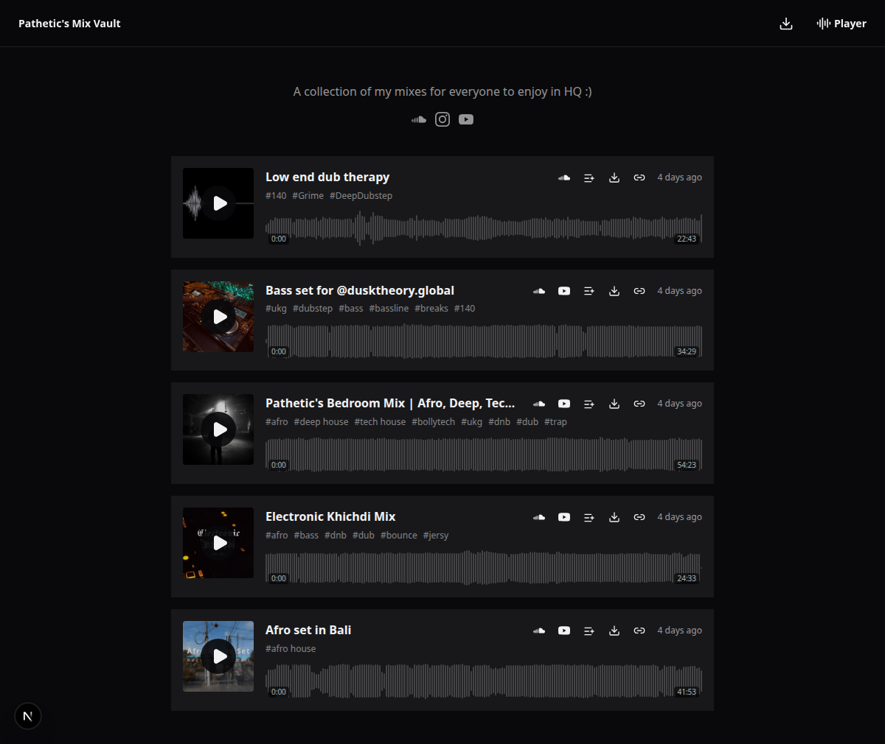
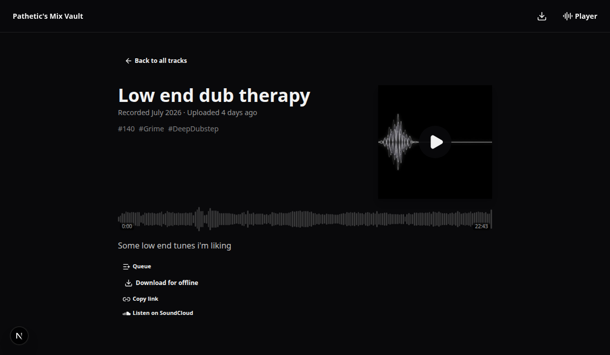
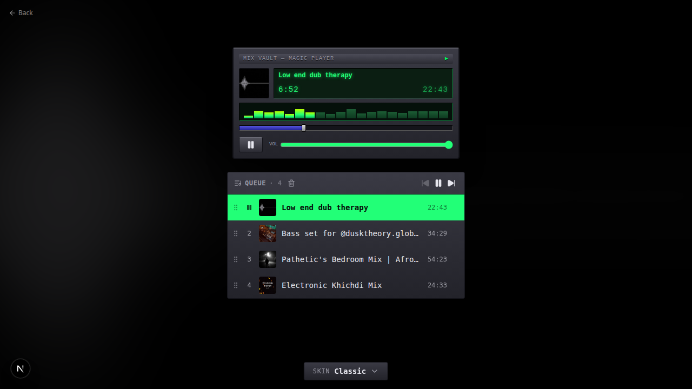
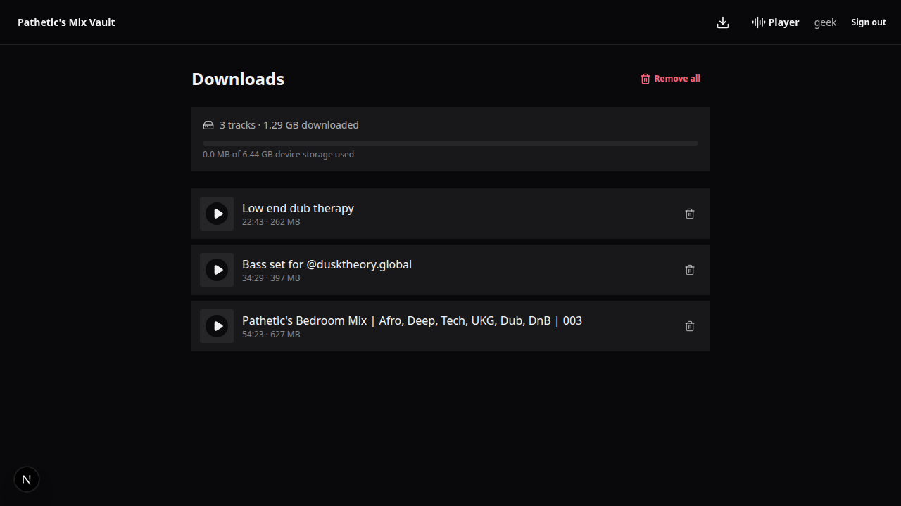
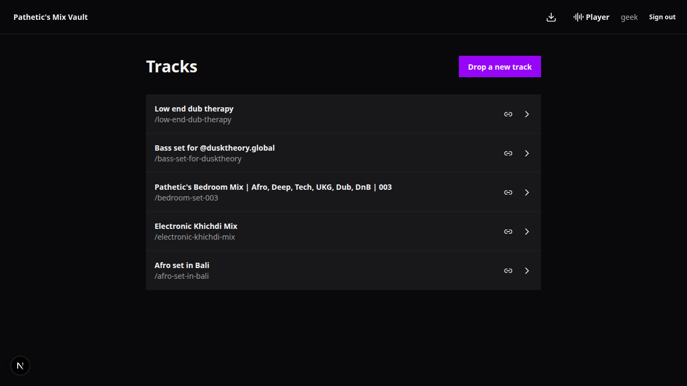
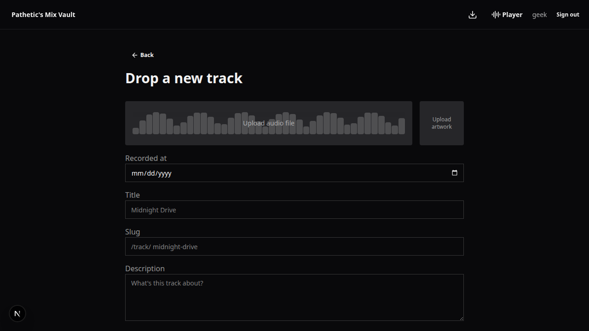

# mix-vault

mix-vault is a self-hosted streaming platform for DJs and producers to upload their tracks and host mixes without relying on third-party services. It also provides an API so mixes can be pulled into a site as needed.

## Features

- Upload tracks to R2 (chunked) with cover art; waveforms are generated in the browser
- One player shared across the whole app — a queue, a mini player, and a full-screen mode with a few skins
- Lock-screen and media-key controls (Media Session)
- Download tracks for offline listening — stored on-device (OPFS + IndexedDB), plays with no network
- Installable as a PWA; offline the homepage falls back to your downloads
- Read-only JSON API for embedding tracks elsewhere

## Screenshots

<table>
  <tr>
    <td></td>
    <td></td>
  </tr>
  <tr>
    <td></td>
    <td></td>
  </tr>
  <tr>
    <td></td>
    <td></td>
  </tr>
</table>

## Tech Stack

- Next.js
- React 19
- Cloudflare Workers runtime
- OpenNext.js Cloudflare integration
- Hono for API routing
- Drizzle ORM with Cloudflare D1
- React Query for client data fetching
- Zod for schema validation
- Tailwind CSS + daisyUI
- TypeScript
- pnpm

## Getting Started

Install dependencies and run the app with pnpm.

```bash
pnpm install
pnpm run dev # start development server (runs cf-typegen then next dev)
pnpm run build # build the app (runs cf-typegen then next build)
pnpm run start # start the production server
pnpm run lint # run Next.js lint
pnpm run deploy # build and deploy to Cloudflare
pnpm run upload # build and upload to Cloudflare
pnpm run preview # build and preview on Cloudflare runtime
pnpm run cf-typegen # generate Cloudflare environment types
pnpm run drizzle:generate # generate Drizzle ORM types and schema artifacts
pnpm run d1:apply:local # apply D1 migrations locally
pnpm run d1:apply:prod # apply D1 migrations to remote Cloudflare database
```

### Auth

The app has a single admin user, authenticated via a JWT stored in an httpOnly cookie, with the password checked against a bcrypt hash. Generate credentials with:

```bash
pnpm run generate:auth-secrets # prompts for a username/password, prints AUTH_USERNAME, AUTH_PASSWORD_HASH, JWT_SECRET
```

Add the printed values to `.dev.vars` for local development, or set them with `wrangler secret put <NAME>` for production.

### Default artwork

Artwork is optional when uploading a track. Tracks uploaded without their own image fall back to a shared default object in R2 at `tracks/default/icon.png`, so seed that key once per environment:

```bash
# local dev R2
wrangler r2 object put mix-vault/tracks/default/icon.png --file ./path/to/icon.png --local
# production R2
wrangler r2 object put mix-vault/tracks/default/icon.png --file ./path/to/icon.png --remote
```

The default is a single shared object (not per-track), so it's left untouched when a track's artwork is replaced or the track is deleted.
